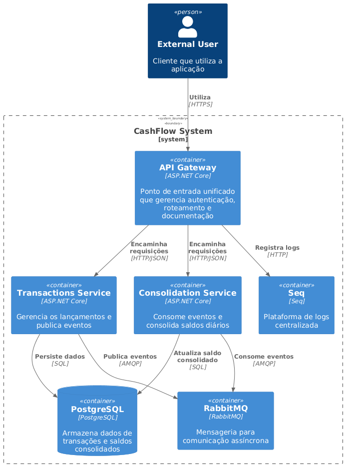

# CashFlow
O **CashFlow** é uma solução de controle de fluxo de caixa com lançamentos financeiros (débito e crédito) e relatórios consolidados do saldo diário. A aplicação adota uma arquitetura baseada em microsserviços, separando as operações de escrita (Transactions) e de leitura/consolidação (Consolidation), e utiliza um API Gateway para centralizar as requisições, autenticação e a documentação da API.



## Descrição

A solução é composta por três componentes principais:

- **Serviço de Lançamentos (Transactions):**
  - Recebe dados de lançamentos (data, tipo, valor, descrição).
  - Valida os comandos utilizando FluentValidation.
  - Registra transações no banco de dados.
  - Publica eventos via MassTransit para notificar o serviço de consolidação.

- **Serviço de Consolidação (Consolidation):**
  - Consome os eventos publicados pelo serviço de lançamentos.
  - Consolida os lançamentos e atualiza o saldo diário.
  - Exponibiliza endpoints para consulta do saldo consolidado.
        
- **API Gateway:**
  - Atua como porta de entrada unificada para a aplicação.
  - Gerencia a autenticação via JWT.
  - Encaminha as requisições para os serviços internos.
  - Unifica a documentação da API via Swagger/OpenAPI.

## Como Executar o Projeto

Esta seção descreve os passos para rodar o projeto, tanto localmente quanto via Docker Compose.

### Executando Localmente (sem Docker)

1. **Pré-requisitos:**
    - .NET 9 SDK instalado.
    - PostgreSQL instalado e rodando  
      - Certifique-se de que a connection string esteja configurada corretamente no `appsettings.Development.json`.
    - RabbitMQ e Seq devem estar acessíveis  
      - (Você pode executá-los via Docker ou em instâncias locais).

2. **Configuração:**
    - Configure as variáveis de ambiente ou os arquivos de configuração (`appsettings.json`) conforme necessário para apontar para os serviços locais:
        - Exemplo:
            - `AppSettings:ServiceUrls:Transactions = http://localhost:5001`
            - `AppSettings:ServiceUrls:Consolidation = http://localhost:5002`
            - `AppSettings:Seq:Url = http://localhost:5341`
    - Certifique-se de que o ambiente esteja definido como `Development`.

3. **Executando a Solução:**
    - Abra a solução no Visual Studio ou VS Code.
    - Compile o projeto.
    - Inicie a aplicação (o API Gateway será o ponto de entrada, normalmente rodando em `http://localhost:5000`).
    - Acesse a URL `http://localhost:5000/swagger/index.html` para visualizar a documentação da API.

### Executando via Docker Compose

1. **Pré-requisitos:**
    - Docker e Docker Compose instalados.

2. **Configuração:**
    - Verifique o arquivo `docker-compose.yml` na raiz do projeto. Nele, as portas dos serviços estão mapeadas da seguinte forma:
        - **API Gateway:** acessível em `http://localhost:5000`
        - **Transactions Service:** 
          - (acessado apenas internamente, na porta 8080 do container)
        - **Consolidation Service:**
          - (acessado apenas internamente, na porta 8080 do container)
        - **PostgreSQL:** na porta `5432`
        - **RabbitMQ:** nas portas `5672` (AMQP) e `15672` (interface de gerenciamento)
        - **Seq:** acessível em `http://localhost:5341`
    - As variáveis de ambiente definidas no `docker-compose.yml` garantem que os serviços se comuniquem corretamente entre si.

3. **Rodando o Projeto:**
    - Na raiz do projeto, abra o terminal e execute:
      ```bash
      docker-compose up --build
      ```
    - Aguarde até que todos os containers sejam iniciados. Verifique os logs para confirmar que o bus do MassTransit e os demais serviços iniciaram sem erros.
    - Acesse o API Gateway em `http://localhost:5000` e a documentação Swagger em `http://localhost:5000/swagger/index.html`.

4. **Parando os Containers:**
    - Para parar os containers, pressione `Ctrl+C` no terminal ou execute:
      ```bash
      docker-compose down
      ```
### Considerações Adicionais

- **Ambientes Diferenciados:**  
  O projeto está configurado para utilizar variáveis de ambiente e arquivos de configuração específicos para cada ambiente (por exemplo, `Development` para local e `Production` para Docker).  
  Garanta que o `ASPNETCORE_ENVIRONMENT` esteja definido corretamente.

- **Logs e Monitoramento:**  
  Os logs são centralizados com Serilog e enviados para Seq.  
  - Em ambiente local, acesse `http://localhost:5341` para visualizar os logs.  
  - No Docker, as variáveis de ambiente garantem que o Seq seja acessível pelo container.

- **Atualização das Migrations:**  
  O API Gateway aplica as migrations automaticamente ao iniciar a aplicação.  
  Caso necessário, você pode executar manualmente:
  ```bash
  dotnet ef database update --project src/Infraestructure --startup-project src/CashFlow.Transactions
        
## Tecnologias Utilizadas

- **.NET 9 / ASP.NET Core Minimal APIs**
- **Entity Framework Core** (PostgreSQL)
- **MassTransit & RabbitMQ**
- **Serilog & Seq**
- **FluentValidation**
- **Polly**
- **Docker & Docker Compose**
- **MediatR**
- **xUnit, Moq, FluentAssertions**

## Decisões Arquiteturais

* Microsserviços e API Gateway:
A aplicação foi dividida em serviços independentes (Transactions e Consolidation) que se comunicam de forma assíncrona via MassTransit. O API Gateway centraliza a entrada de requisições, gerencia a autenticação (JWT) e encaminha as chamadas para os serviços correspondentes.

* CQRS e DDD:
Adotamos o padrão CQRS para separar os casos de uso de escrita e leitura. As regras de negócio e os contratos (interfaces) foram definidos na camada Core (Domínio), enquanto as implementações que interagem com recursos externos (banco, mensageria, etc.) foram implementadas na camada de Infraestrutura.

* Mensageria Assíncrona:
Utilizamos MassTransit com RabbitMQ para desacoplar a comunicação entre os serviços, garantindo que o serviço de consolidação processe os eventos de transação de forma resiliente.

* Resiliência e Monitoramento:
Políticas de retry e circuit breaker foram implementadas (com Polly) para lidar com falhas transitórias nas chamadas HTTP. O Serilog, integrado ao Seq, possibilita o monitoramento centralizado dos logs.

* Configurações Dinâmicas por Ambiente:
As URLs dos serviços, chaves JWT e outras configurações são centralizadas e podem ser sobrescritas via variáveis de ambiente. Isso permite que a aplicação funcione corretamente tanto em ambiente local (usando localhost) quanto em ambientes de container (usando os nomes dos serviços no Docker Compose).

## Melhorias e Adaptações Futuras

* Aprimoramento das Políticas de Resiliência:
Refinar as configurações de retry, circuit breaker e timeout utilizando Polly, de forma a tornar as chamadas HTTP ainda mais robustas.

* Integração com um Provedor de Identidade Centralizado:
Considerar a implementação de uma solução de Identity Server ou o uso de provedores como Auth0/Azure AD para gerenciamento centralizado de usuários e emissão de tokens JWT.

* Monitoramento, Observabilidade e Alertas:
Integrar com ferramentas como Prometheus, APM e Grafana para monitorar métricas de desempenho, uso e saúde dos serviços, além de configurar alertas para anomalias.

* Escalabilidade Dinâmica:
Explorar a orquestração via Kubernetes ou outras soluções de autoescalonamento, possibilitando a escalabilidade horizontal dos serviços conforme a demanda.

* Cache Distribuído:
Implementar um cache distribuído (por exemplo, Redis) para melhorar o desempenho das consultas e reduzir a carga no banco de dados.

* Automação de Testes e CI/CD:
Expandir a cobertura de testes (unitários e de integração) e configurar pipelines de CI/CD para build, testes e deploy automatizados.
